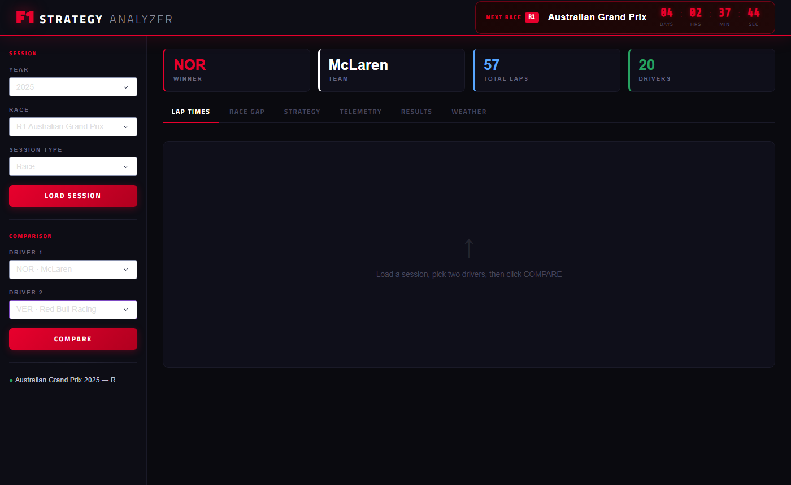
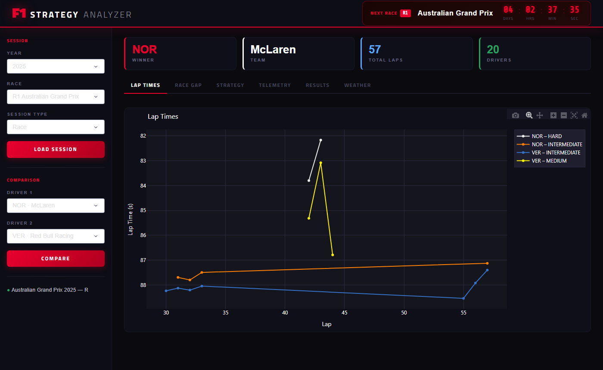
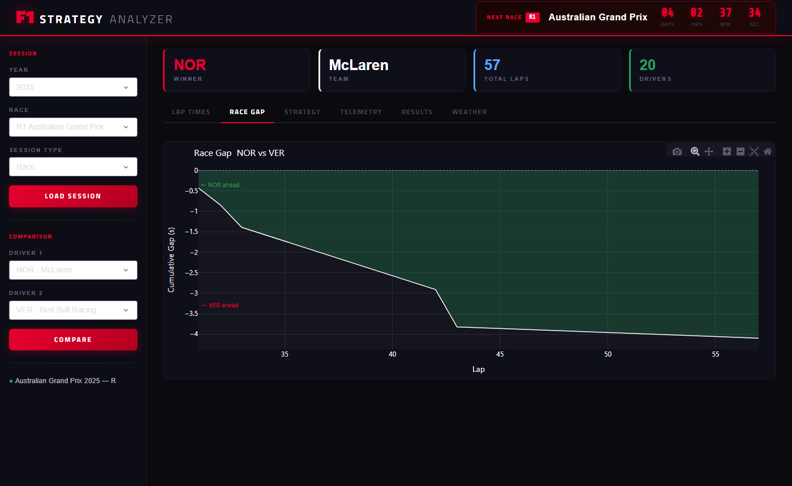
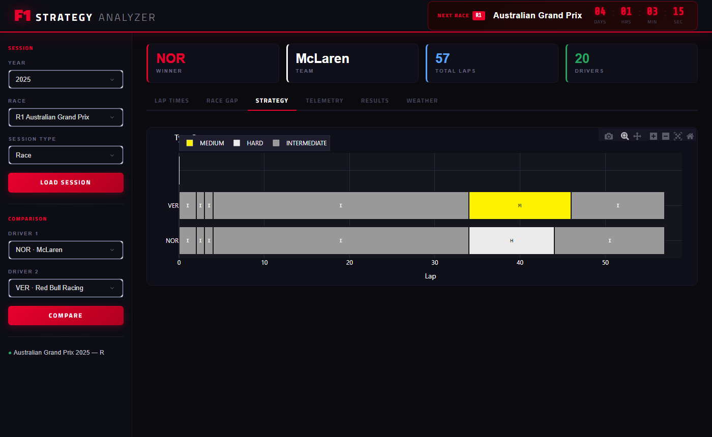
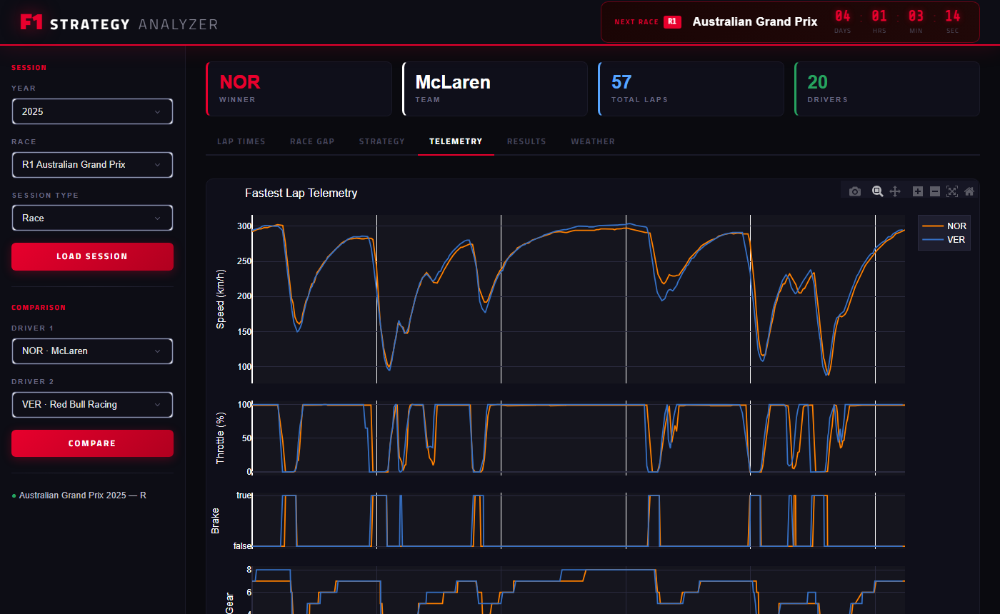
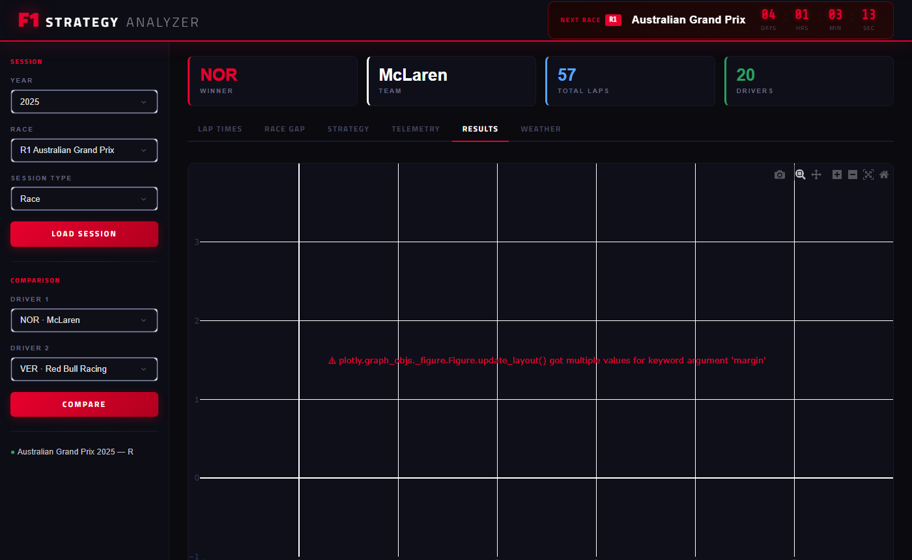
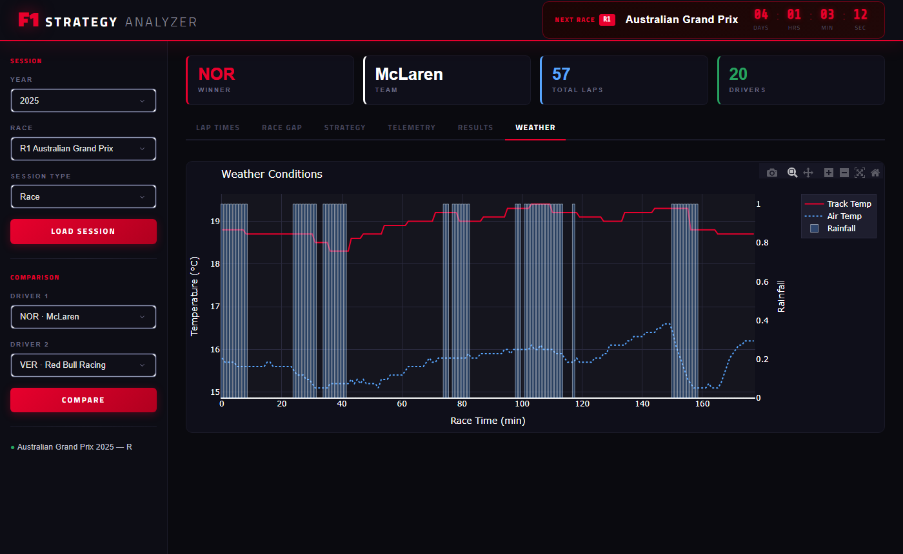

# F1 Race Strategy Analyzer

> Interactive telemetry dashboard powered by **official F1 timing data** via the [FastF1](https://theoehrly.github.io/Fast-F1/) API.  
> Pick any race from 2018 – 2026, choose two drivers, and explore lap-by-lap strategy in a modern dark UI.

---

## Preview

<!-- Add a full-width banner screenshot here -->
<!-- Recommended: 1400×800px, capture the full app after loading a race -->


---

## Features

### Six Analysis Tabs

| Tab | What You See |
|-----|-------------|
| **Lap Times**  | Per-lap times coloured by tyre compound for both drivers |
| **Race Gap**   | Cumulative lap-delta — green/red fill shows who leads and by how much |
| **Strategy**   | Horizontal stacked-bar tyre stint chart matching the F1 broadcast graphic |
| **Telemetry**  | 4-panel fastest-lap trace: Speed · Throttle · Brake · Gear vs Distance |
| **Results**    | Full finishing order, colour-coded by constructor |
| **Weather**    | Air & track temperature with rainfall overlay |

### Live Next-Race Countdown
The header shows a live countdown to the next race on the current season calendar, updated every second with no server round-trips (clientside callback).

### Performance
All six charts are computed **once** on Compare click and stored in the browser. Tab switches are instant — no re-fetching, no re-processing. Sessions are cached in-process via `lru_cache` and on disk via FastF1's built-in cache.

---

## Screenshots

<!-- Lap Times tab -->
### Lap Times


<!-- Race Gap tab -->
### Race Gap


<!-- Tyre Strategy tab -->
### Tyre Strategy


<!-- Telemetry 4-panel tab -->
### Telemetry


<!-- Race Results tab -->
### Race Results


<!-- Weather tab -->
### Weather


---

## Stack

| Layer | Technology |
|-------|-----------|
| Data  | [FastF1](https://theoehrly.github.io/Fast-F1/) – official F1 live timing + Ergast |
| Processing | Pandas · NumPy |
| Charts | Plotly (dark F1-style theme) |
| UI | Plotly Dash · Dash Bootstrap Components |
| Fonts | Titillium Web (the actual F1 broadcast typeface) · Share Tech Mono |

---

## Quick Start

```bash
# Python 3.10+ required
pip install -r requirements.txt

python app.py
# Open http://localhost:8050
```

First load of a session downloads data to `~/.f1_cache`. Every subsequent load of the same session is instant.

---

## How to Use

1. **Year** — select from 2018 to the current season
2. **Race** — dropdown auto-populates with that season's calendar
3. **Session Type** — Race, Qualifying, or any Practice session
4. **Load Session** — fetches data; stat cards (winner, team, laps, drivers) appear for races
5. **Driver 1 / Driver 2** — pick any two drivers from that session
6. **Compare** — builds all six charts at once; switch tabs instantly

---

## Project Structure

```
f1-race-strategy-analyzer/
├── app.py              # Dash app — layout, callbacks, pre-computation
├── data.py             # FastF1 data loading layer (lru_cache'd)
├── plots.py            # Plotly figure builders — 6 chart functions
├── assets/
│   └── style.css       # Full custom dark theme (no Bootstrap dependency)
├── requirements.txt
└── README.md
```

---

## Data Sources

FastF1 fetches data from:
- **F1 Live Timing** — official session telemetry, lap times, car data
- **Ergast Motor Racing API** — historical results and session metadata

No API key required. Data availability starts from the 2018 season.

---

## Notes

- Some pre-2019 sessions have incomplete telemetry (position/car data)
- Qualifying and practice sessions show only the tabs relevant to that session type
- Requires Python 3.10+ for `dict | None` type hints

---

## License

MIT


---

## Features

| Tab | What You See |
|-----|-------------|
| **Lap Times** | Per-lap time overlaid with tyre compound colour for both selected drivers |
| **Race Gap** | Cumulative lap-delta with green/red shaded fill (who is ahead and by how much) |
| **Strategy** | Horizontal stacked-bar tyre stint chart matching the F1 broadcast graphic |
| **Telemetry** | 4-panel fastest-lap trace – Speed / Throttle / Brake / Gear vs Distance |
| **Results** | Full finishing order colour-coded by constructor |
| **Weather** | Air & track temperature with rainfall overlay |

---

## Stack

- **FastF1** – official F1 timing & telemetry API (Ergast + F1 live timing)
- **Plotly** – figure generation with dark F1-style theme
- **Plotly Dash** – reactive web UI (callbacks chain year → race → drivers → charts)
- **Dash Bootstrap Components** – Cyborg dark theme layout
- **Pandas / NumPy** – data wrangling

---

## Quick Start

```bash
# 1 – install dependencies (Python 3.10+)
pip install -r requirements.txt

# 2 – run the app
python app.py

# 3 – open browser
# http://localhost:8050
```

The first time you load a session FastF1 downloads and caches the data to
`~/.f1_cache`. Subsequent loads of the same session are instant.

---

## Usage

1. **Select year** (2018 – 2024) from the left panel.
2. **Select race** – the dropdown populates automatically with that season's calendar.
3. **Select session type** – Race / Qualifying / Practice.
4. Click **Load Session** – driver list populates.
5. Choose **Driver 1** and **Driver 2**, then click **Compare**.
6. Switch between the six tabs to explore the data.

---

## Screenshots

> *(Generated with Firefox full-page screenshot)*

| Lap Times | Strategy | Telemetry |
|-----------|----------|-----------|
|  |  |  |

---

## Project Structure

```
f1-race-strategy-analyzer/
├── app.py          # Dash app, layout & callbacks
├── data.py         # FastF1 data loading layer
├── plots.py        # Plotly figure builders (6 charts)
├── requirements.txt
└── README.md
```

---

## Notes

- Data accuracy depends on FastF1 source availability. Some older sessions (pre-2019) may have incomplete telemetry.
- The app caches session data locally — no API key required.
- Designed for Python 3.10 or later.

---

## License

MIT
