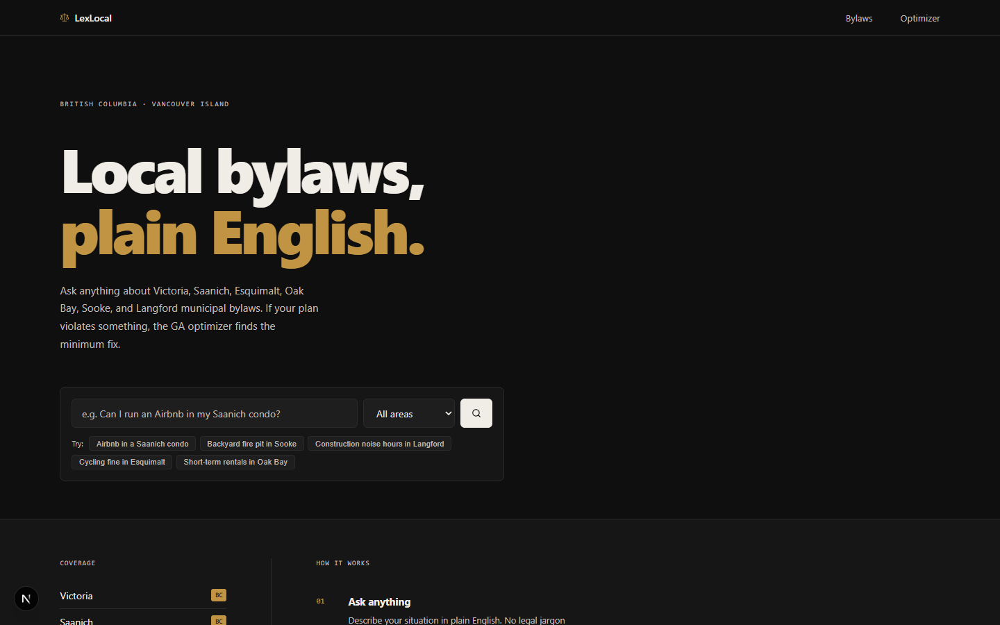
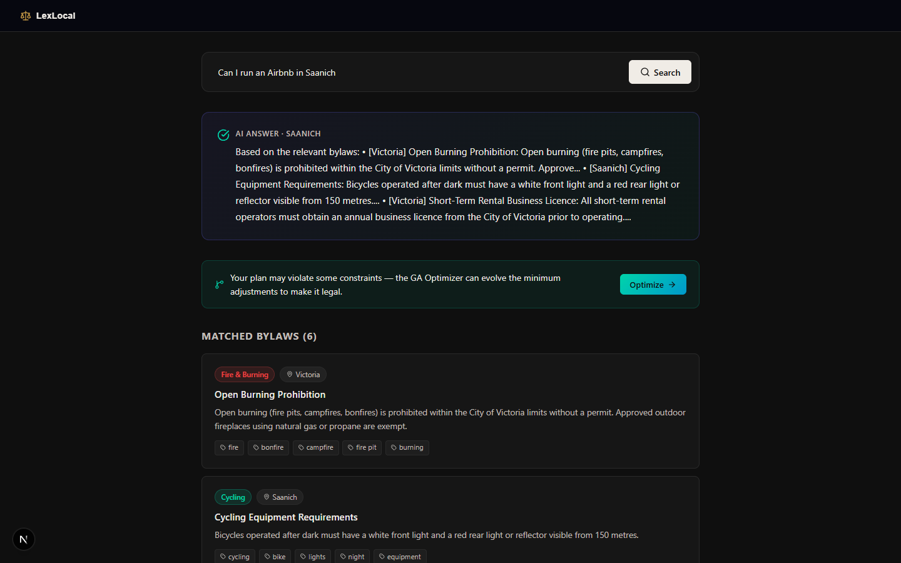
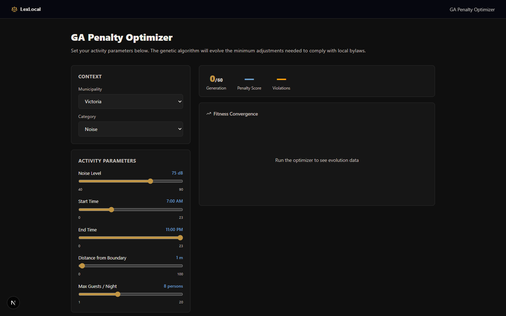
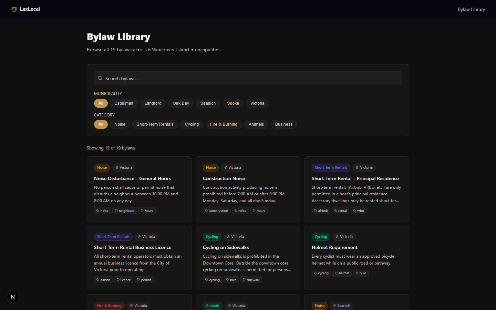

# LexLocal — Vancouver Island Bylaw Intelligence

Ask plain-English questions about municipal bylaws across 6 Vancouver Island municipalities. If your activity violates something, a **Genetic Algorithm** evolves the minimum parameter changes needed to make it compliant.

**Stack:** Next.js 16 · FastAPI · Gemini 2.0 Flash · Python GA engine · WebSocket streaming · Recharts

---

## Screenshots

### Home


### Query Results


### GA Optimizer


### Bylaw Library


---

## Features

- **Plain-English queries** — Gemini 2.0 Flash matches your question against the real bylaw corpus
- **GA Penalty Optimizer** — genetic algorithm evolves minimum adjustments to noise level, hours, distance, guests to achieve compliance; streams live fitness convergence over WebSocket
- **6 municipalities** — Victoria, Saanich, Esquimalt, Oak Bay, Sooke, Langford
- **Categories** — Noise, Short-Term Rentals, Cycling, Fire & Burning, Animals, Business

## Running locally

**Backend**
```bash
cd backend
python -m venv venv && venv/Scripts/activate   # Windows: .\venv\Scripts\Activate.ps1
pip install -r requirements.txt                # or: pip install fastapi uvicorn python-dotenv google-genai numpy
cp .env.example .env                           # add GEMINI_API_KEY
uvicorn main:app --reload --port 8000
```

**Frontend**
```bash
cd frontend
npm install
npm run dev          # http://localhost:3000
```

## Project structure

```
lexlocal/
├── backend/
│   ├── main.py              # FastAPI app — REST + WebSocket endpoints
│   ├── data/bylaws.py       # 20+ bylaws corpus for all 6 municipalities
│   └── ga/engine.py         # Async GA engine — tournament selection, elitism, Gaussian mutation
└── frontend/
    ├── app/page.tsx          # Landing page
    ├── app/query/page.tsx    # AI query results
    ├── app/optimize/page.tsx # Live GA visualizer
    ├── app/bylaws/page.tsx   # Filterable bylaw library
    └── lib/api.ts            # TypeScript API + WebSocket client
```
