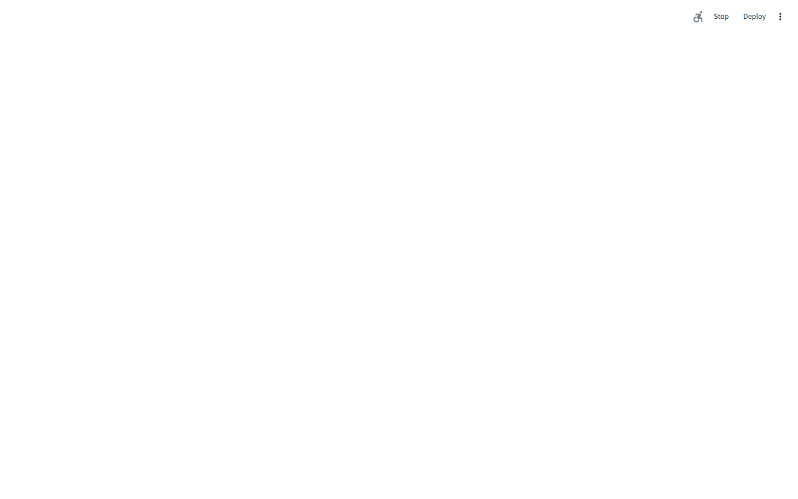
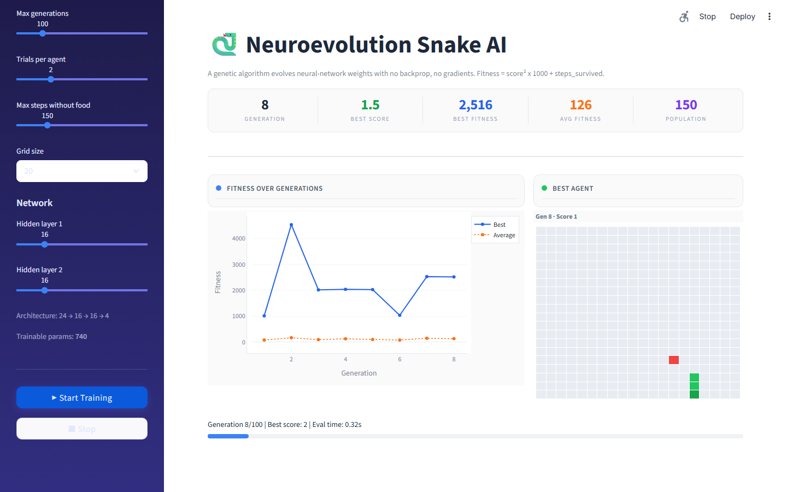
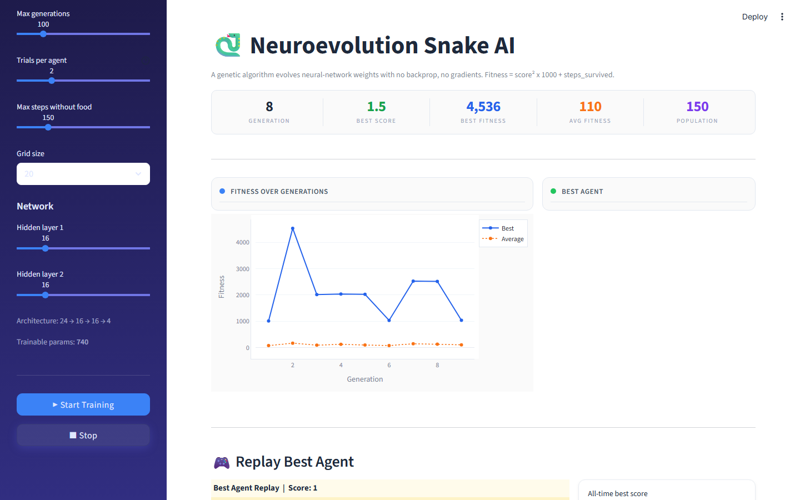

# Neuroevolution Snake AI

A genetic algorithm that evolves neural-network weights to play Snake, with **no backprop, no gradient descent**. Fitness is determined entirely by how well each agent plays: agents that eat more food and survive longer score higher, and their genetic material is preferentially passed to the next generation.

Watch it learn in real time through a **Streamlit** dashboard: live fitness curves, per-generation best agent preview, and a full animated replay of the champion agent.

| Idle Dashboard | Sidebar Controls |
|---|---|
|  |  |

| Mid-Training | Replay Section |
|---|---|
|  |  |

---

## How it works

```
Initial population of N agents
  Each agent = a tiny feedforward neural net (24 → 16 → 16 → 4)
  Weights initialised randomly (Xavier)
        │
        ▼  each generation
┌──────────────────────────────────────────┐
│  1. EVALUATE                             │
│     Run every agent on Snake             │
│     fitness = score² × 1000 + steps      │
│                                          │
│  2. SELECT                               │
│     Tournament selection (k=5)           │
│     Top-k agents kept as elites          │
│                                          │
│  3. REPRODUCE                            │
│     Uniform crossover of weight vectors  │
│     Gaussian mutation (rate + macro)     │
└──────────────────────────────────────────┘
        │
        ▼
 Next generation, repeat until done
```

### Neural network
| Layer | Size | Activation |
|---|---|---|
| Input | 24 | none |
| Hidden 1 | 16 | tanh |
| Hidden 2 | 16 | tanh |
| Output | 4 | argmax |

The **24 inputs** are cast as 8 vision rays (N, NE, E, SE, S, SW, W, NW), each returning:
- `1 / distance_to_wall`
- `1 / distance_to_body` (0 if not seen)
- `food_seen` (binary)

The **4 outputs** map to absolute directions: Up / Right / Down / Left. 180° reversals are suppressed.

### Genetic operators
- **Elitism**: top 3 agents survive unchanged (configurable)
- **Tournament selection**: random k-subset, fittest wins
- **Uniform crossover**: each gene randomly inherited from one of two parents
- **Gaussian mutation**: micro-mutations (sigma=0.2, 10% of genes) + macro-mutations (sigma=1.0, 1% of genes) to escape local optima

---

## Quick start

```bash
pip install -r requirements.txt
streamlit run app.py
```

Open http://localhost:8501

---

## Dashboard

| Panel | Description |
|---|---|
| Stat cards | Generation, best score, best/avg fitness, population size |
| Fitness chart | Best and average fitness over all generations (live) |
| Agent preview | Best agent's final board state after each generation |
| Replay | Animated Plotly figure of the all-time best agent |

All hyperparameters are tunable in the sidebar without code changes:
- Population size, elite count, tournament size
- Mutation rate and standard deviation
- Max generations, trials per agent, starvation limit
- Grid size and network hidden layer widths

---

## Tech

| | |
|---|---|
| Language | Python 3.11 |
| Neural net | NumPy only (no PyTorch / TensorFlow) |
| GA | Custom implementation |
| Dashboard | Streamlit + Plotly |
| Lines of code | ~500 |

---

## Project structure

```
neuroevolution-snake/
├── app.py          – Streamlit dashboard (UI + training loop)
├── genetic.py      – GA operators: evaluate, select, crossover, mutate, evolve
├── network.py      – NumPy feedforward neural network
├── snake_env.py    – Snake game environment + 8-direction vision
└── requirements.txt
```
